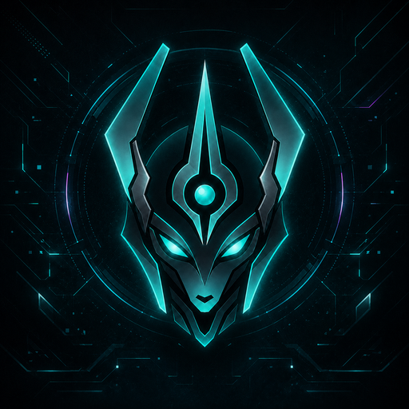
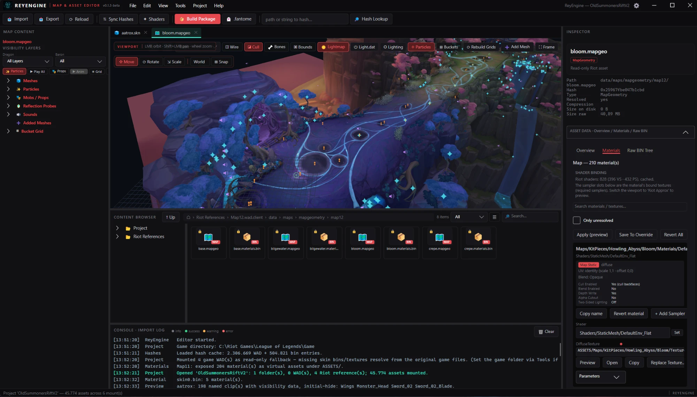
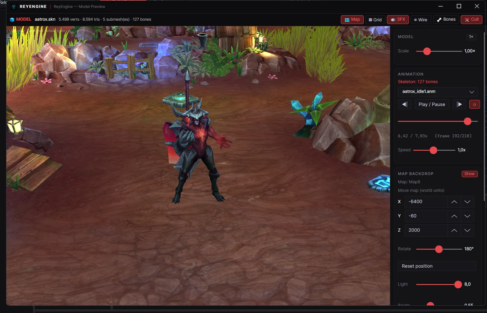
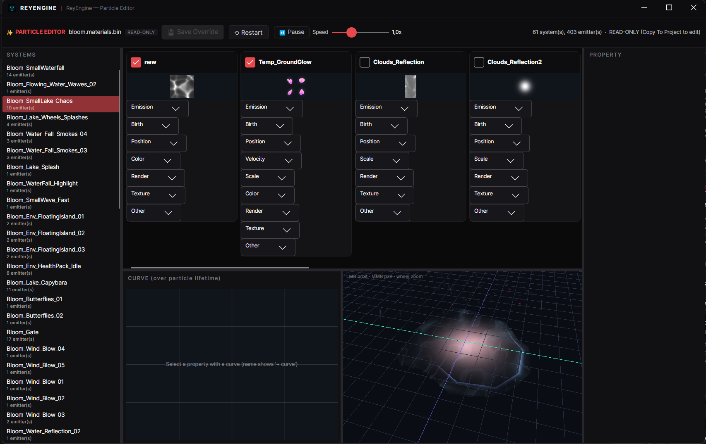
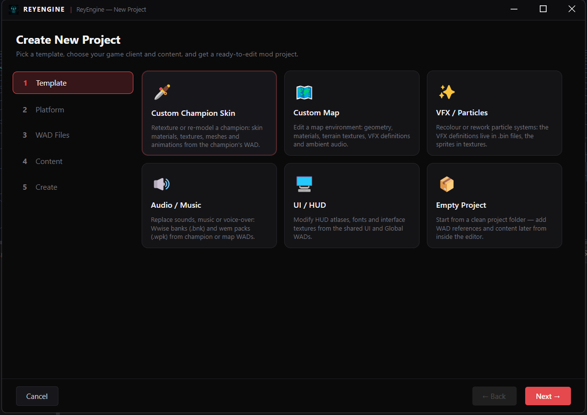
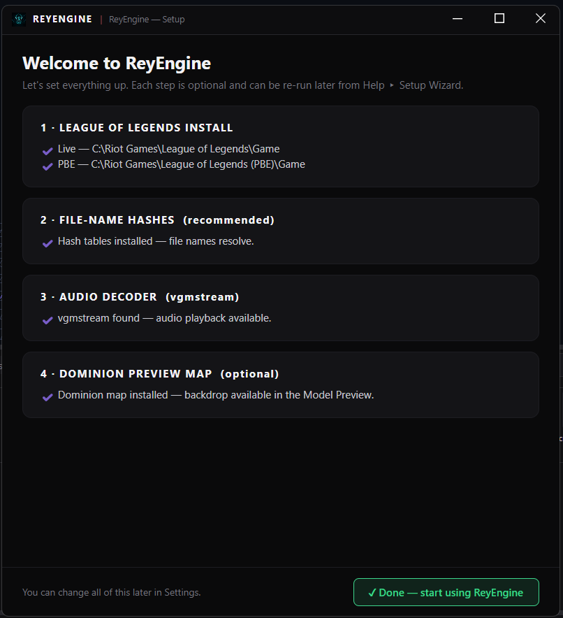

<p align="center">
  
</p>

<h1 align="center">ReyEngine</h1>

<p align="center">
  <b>A modern map &amp; asset editor for League of Legends mods</b> — think Unreal/Unity for LoL assets.<br/>
  Built by <a href="https://github.com/TheKillerey">TheKillerey</a>.
</p>

<p align="center">
  <a href="https://github.com/TheKillerey/ReyEngine/releases"></a>
  <a href="https://github.com/TheKillerey/ReyEngine/releases"></a>
  <a href="LICENSE"></a>
</p>



<table>
  <tr>
    <td width="50%">
      <br/>
      <sub><b>Model Preview</b> — champions on the classic Dominion map, with in-game-accurate animations, VFX &amp; SFX</sub>
    </td>
    <td width="50%">
      <br/>
      <sub><b>Particle Editor</b> — live-edit VFX systems with in-viewport playback</sub>
    </td>
  </tr>
  <tr>
    <td width="50%">
      <br/>
      <sub><b>New Project wizard</b> — templates for skins, maps, VFX, audio and UI mods</sub>
    </td>
    <td width="50%">
      <br/>
      <sub><b>Setup wizard</b> — hashes, audio decoder and preview map in a few clicks</sub>
    </td>
  </tr>
</table>

> **Status: beta.** Windows only. Expect rough edges — please report issues!

## What it does

**Projects**
- Unreal-style **New Project wizard**: pick a template (Champion Skin / Map / VFX / Audio / UI / Empty), choose your **LIVE or PBE** client (auto-detected), tick the WADs you want, pick which content categories to extract — get a ready-to-edit mod project (cslol-style folders + read-only Riot references).
- **Import .fantome**: convert any existing mod package into an editable project — mod name/author/thumbnail carry over, WADs unpack with resolved file names, and matching Riot WADs attach as references. Full round trip: *import → edit → Build Package → new .fantome*.
- Non-destructive by design: Riot files are never modified; edits become **project overrides** that build into a distributable `.wad.client` / `.fantome` package.
- **First-run setup wizard** gets a fresh install working in a few clicks: hashes, audio decoder, optional preview map (re-run any time via *Help ▸ Setup Wizard*).

**Maps**
- Load `.mapgeo` maps with baked lightmaps, terrain-blend & flowmap-water shaders, GrassTint (VertexDeform), display-correct decals.
- Select / move / rotate / scale **map meshes, particles and sounds** with viewport gizmos — full undo, snapping, world/local space. Edits are saved by surgical byte patching (originals stay byte-exact).
- **Add new meshes to a map**: import `.obj` / `.scb` / `.sco`, place with the gizmo, assign a map material, save — appended straight into the mapgeo.
- **Bucket grids**: view the real 3D culling bake, and regenerate grids after editing geometry.
- **Dynamic lights**: load classic Riot `Light.dat` point lights, fit them to any map (scale/offset), full lighting panel (sun, sky, lightmap brightness).
- **Classic NVR maps**: the old-format Dominion / Crystal Scar loads with faithful four-blend ground shading — used as the Model Preview backdrop (separate ~66 MB [map asset pack](https://github.com/TheKillerey/ReyEngine/releases/tag/maps)).

**Model Preview**
- Champion viewer with animations, per-submesh visibility (game-accurate: skin-bin initial hide + per-clip show/hide events, with manual override), and model scale.
- **Plays like in-game**: animation clips trigger their VFX bone-attached and their SFX through the champion's real Wwise banks — frame-accurate, retriggered on loop.
- Preview champions **standing on the Dominion map**, lit by its original point lights — movable, rotatable, tunable.

**Assets**
- Content Browser with Explorer-grade file ops: rename, delete, move, drag & drop (in and out), open-with-text-editor, thumbnails, type filters, search.
- Texture/mesh/skeleton/animation preview, `.bin` structure editor, material editor with Riot shader awareness, hash resolving (CommunityDragon).
- **Particle editor**: live-edit VFX systems (colors, curves, textures) with in-viewport playback.
- **Audio**: browse Wwise banks, play events (vgmstream), replace `.wem` sounds, positional map ambience.

**Polish**
- Dark themes (Crimson / Kalista / Violet) switchable live, custom chrome on every window, auto-update check against GitHub releases.

## Getting started

1. Install [League of Legends](https://www.leagueoflegends.com) (LIVE and/or PBE).
2. Download the latest release from [Releases](https://github.com/TheKillerey/ReyEngine/releases) and unzip, or build from source:
   ```
   dotnet build src/ReyEngine.App/ReyEngine.App.csproj -c Release
   ```
   Requires the .NET 10 SDK, Windows.
3. Launch — the **setup wizard** walks you through hashes, the audio decoder, and the optional preview map.
4. **File ▸ New Project…** (or **Import .fantome…**) and start modding.

## Built with

[LeagueToolkit](https://github.com/LeagueToolkit/LeagueToolkit) · [Avalonia UI](https://avaloniaui.net) · [Silk.NET](https://github.com/dotnet/Silk.NET) · [CommunityToolkit](https://github.com/CommunityToolkit/dotnet) · [NAudio](https://github.com/naudio/NAudio) · BCnEncoder.NET · SharpGLTF · Inter

Thanks to [CommunityDragon](https://communitydragon.org) (hashes), [vgmstream](https://github.com/vgmstream/vgmstream) (Wwise decoding), the [MapgeoAddon](https://github.com/TheKillerey/MapgeoAddon) research, and the League modding community.

## License

ReyEngine is released under the [MIT License](LICENSE). © 2026 TheKillerey.

## Code signing policy

Free code signing for Windows binaries is provided by [SignPath.io](https://signpath.io), with a certificate issued by the [SignPath Foundation](https://signpath.org).

Every signed release is built automatically by GitHub Actions from this public repository; SignPath verifies that the signed binary originates from the tagged source before signing it. No binary is signed from a local machine.

- **Committers & reviewers:** [TheKillerey](https://github.com/TheKillerey)
- **Approvers:** [TheKillerey](https://github.com/TheKillerey)

## Privacy policy

ReyEngine does not transfer any personal data to networked systems. It makes a few outbound network requests, all initiated by the user or clearly disclosed:

- **Update check** — on startup (and via *Help ▸ About*), it queries the public GitHub Releases API for this repository to see whether a newer version exists. Only the request itself is sent; no personal or usage data is transmitted.
- **Hash sync** — when you choose to sync hash tables, it downloads public hash lists from [CommunityDragon](https://communitydragon.org).
- **Setup downloads** — the setup wizard downloads [vgmstream](https://github.com/vgmstream/vgmstream) and the optional [map asset pack](https://github.com/TheKillerey/ReyEngine/releases/tag/maps) from GitHub when you click their buttons.

ReyEngine only reads your local League of Legends installation and writes to the project/output folders you select. Uninstall by deleting the extracted program folder.

## Legal

ReyEngine was created under Riot Games' ["Legal Jibber Jabber"](https://www.riotgames.com/en/legal) policy using assets owned by Riot Games. Riot Games does not endorse or sponsor this project.
