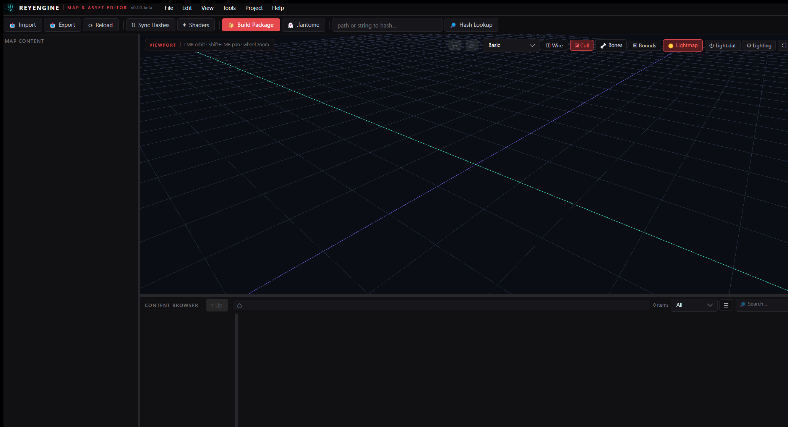

# ReyEngine

**A modern map & asset editor for League of Legends mods** — think Unreal/Unity for LoL assets. Built by [TheKillerey](https://github.com/TheKillerey).



> **Status: v0.1.0-beta.** Windows only. Expect rough edges — please report issues!

## What it does

**Projects**
- Unreal-style **New Project wizard**: pick a template (Champion Skin / Map / VFX / Audio / UI / Empty), choose your **LIVE or PBE** client (auto-detected), tick the WADs you want, pick which content categories to extract — get a ready-to-edit mod project (cslol-style folders + read-only Riot references).
- Non-destructive by design: Riot files are never modified; edits become **project overrides** that build into a distributable `.wad.client` / `.fantome` package.

**Maps**
- Load `.mapgeo` maps with baked lightmaps, terrain-blend & flowmap-water shaders, GrassTint (VertexDeform), display-correct decals.
- Select / move / rotate / scale **map meshes, particles and sounds** with viewport gizmos — full undo, snapping, world/local space. Edits are saved by surgical byte patching (originals stay byte-exact).
- **Add new meshes to a map**: import `.obj` / `.scb` / `.sco`, place with the gizmo, assign a map material, save — appended straight into the mapgeo.
- **Bucket grids**: view the real 3D culling bake, and regenerate grids after editing geometry.
- **Dynamic lights**: load classic Riot `Light.dat` point lights, fit them to any map (scale/offset), full lighting panel (sun, sky, lightmap brightness).

**Assets**
- Content Browser with Explorer-grade file ops: rename, delete, move, drag & drop (in and out), open-with-text-editor, thumbnails, type filters, search.
- Texture/mesh/skeleton/animation preview, `.bin` structure editor, material editor with Riot shader awareness, hash resolving (CommunityDragon).
- **Particle editor**: live-edit VFX systems (colors, curves, textures) with in-viewport playback.
- **Audio**: browse Wwise banks, play events (vgmstream), replace `.wem` sounds, positional map ambience.

**Polish**
- Dark themes (Crimson / Kalista / Violet) switchable live, custom chrome on every window, auto-update check against GitHub releases.

## Getting started

1. Install [League of Legends](https://www.leagueoflegends.com) (LIVE and/or PBE).
2. Download the latest release from [Releases](https://github.com/TheKillerey/ReyEngine/releases) and unzip, or build from source:
   ```
   dotnet build src/ReyEngine.App/ReyEngine.App.csproj -c Release
   ```
   Requires the .NET 10 SDK, Windows.
3. Launch → **File ▸ New Project…** → follow the wizard.

## Built with

[LeagueToolkit](https://github.com/LeagueToolkit/LeagueToolkit) · [Avalonia UI](https://avaloniaui.net) · [Silk.NET](https://github.com/dotnet/Silk.NET) · [CommunityToolkit](https://github.com/CommunityToolkit/dotnet) · [NAudio](https://github.com/naudio/NAudio) · BCnEncoder.NET · SharpGLTF · Inter

Thanks to [CommunityDragon](https://communitydragon.org) (hashes), [vgmstream](https://github.com/vgmstream/vgmstream) (Wwise decoding), the [MapgeoAddon](https://github.com/TheKillerey/MapgeoAddon) research, and the League modding community.

## Legal

ReyEngine was created under Riot Games' ["Legal Jibber Jabber"](https://www.riotgames.com/en/legal) policy using assets owned by Riot Games. Riot Games does not endorse or sponsor this project.
