<p align="center">
  <picture>
    <source media="(prefers-color-scheme: dark)" srcset="docs/branding/reyengine-logo-wide-on-dark.png" />
    <source media="(prefers-color-scheme: light)" srcset="docs/branding/reyengine-logo-wide-on-light.png" />
    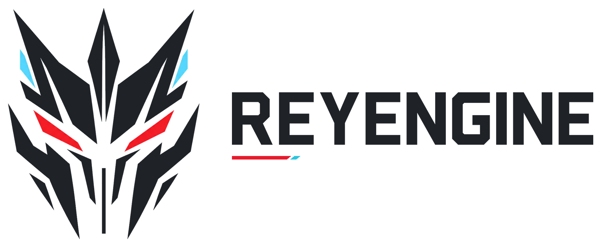
  </picture>
</p>

<p align="center">
  <b>A modern map &amp; asset editor for League of Legends mods</b> — think Unreal/Unity for LoL assets.<br/>
  Built by <a href="https://github.com/TheKillerey">TheKillerey</a>.
</p>

<!-- badgen.net (shields.io kept timing out through GitHub's image proxy); a total-downloads badge
     needs shields' /github/downloads/…/total — re-add when shields is reliable again -->
<p align="center">
  <a href="https://github.com/TheKillerey/ReyEngine/releases"></a>
  <a href="LICENSE"></a>
</p>

<p align="center">
  <a href="https://github.com/TheKillerey/ReyEngine/releases/latest"><b>Download</b></a> ·
  <a href="https://github.com/TheKillerey/ReyEngine/wiki/Start-Here"><b>Start here</b></a> ·
  <a href="https://github.com/TheKillerey/ReyEngine/wiki"><b>Wiki</b></a> ·
  <a href="https://github.com/TheKillerey/ReyEngine/issues"><b>Report an issue</b></a>
</p>

ReyEngine opens League of Legends' own files — maps, champions, particles, sounds, the HUD — shows them the way the game draws them, and lets you change them. Your edits are saved in a project folder and packed into a mod you can load with LTK Manager or cslol-manager. The installed game is never modified.

> **Status: beta.** Windows only. Expect rough edges — please report issues!

## Examples

Every clip below was recorded inside ReyEngine's viewport with **Tools ▸ Cinematic Capture**: the maps and their map skins, loaded straight from the game files.

<table>
  <tr>
    <td width="50%">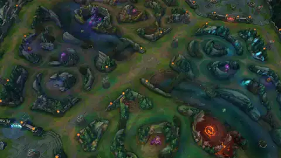<br/><sub><b>Summoner's Rift</b> (Map11) — the Infernal dragon terrain</sub></td>
    <td width="50%">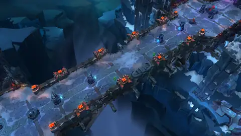<br/><sub><b>Howling Abyss</b> (Map12) — base map</sub></td>
  </tr>
  <tr>
    <td width="50%">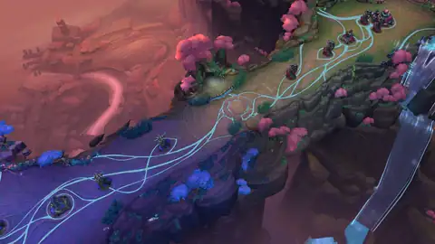<br/><sub><b>Howling Abyss</b> (Map12) — <code>bloom</code> map skin</sub></td>
    <td width="50%">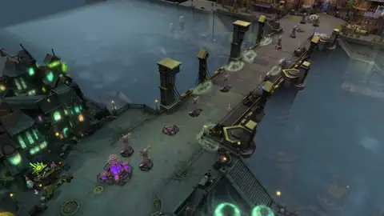<br/><sub><b>Howling Abyss</b> (Map12) — <code>crepe</code> map skin</sub></td>
  </tr>
  <tr>
    <td width="50%">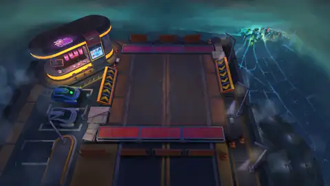<br/><sub><b>Teamfight Tactics</b> (Map22) — <code>cyberpunk</code> arena</sub></td>
    <td width="50%">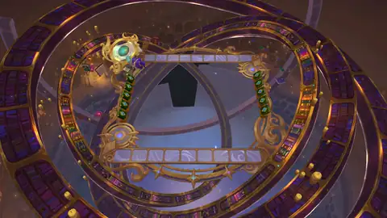<br/><sub><b>Teamfight Tactics</b> (Map22) — <code>magiclibrary</code> arena</sub></td>
  </tr>
  <tr>
    <td width="50%">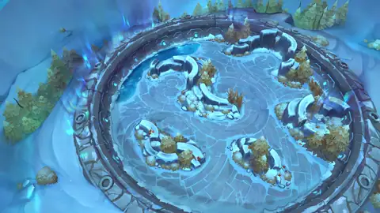<br/><sub><b>Arena</b> (Map30) — ring A</sub></td>
    <td width="50%">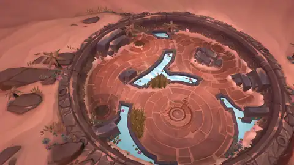<br/><sub><b>Arena</b> (Map30) — ring C</sub></td>
  </tr>
</table>

<p align="center"><a href="https://github.com/TheKillerey/ReyEngine/wiki/Map-Gallery">All 28 recordings in the Map Gallery →</a></p>

## What can I make with it?

| I want to… | Where to start |
|---|---|
| Change the colours of a whole map (a night Rift, a frozen Abyss) | **Tools ▸ Recolor Textures…** — [tutorial](https://github.com/TheKillerey/ReyEngine/wiki/Tutorial-Recolor-a-Map) |
| Play a normal game on a different map skin | **Tools ▸ Map Skin Switcher…** — [tutorial](https://github.com/TheKillerey/ReyEngine/wiki/Tutorial-Map-Skin-Switch) |
| Put a decoration, creature or prop on a map | **Tools ▸ Add prop to map…** — [tutorial](https://github.com/TheKillerey/ReyEngine/wiki/Tutorial-Place-a-Prop) |
| Edit a champion's materials, animations or spell effects | **Tools ▸ Character Editor…** — [Character Editor](https://github.com/TheKillerey/ReyEngine/wiki/Character-Editor) |
| Change a particle effect's colours, textures or timing | **Tools ▸ Open in Particle Editor** — [Particles](https://github.com/TheKillerey/ReyEngine/wiki/Particles) |
| Replace sounds or music | **Tools ▸ Open in Audio Editor** — [Audio](https://github.com/TheKillerey/ReyEngine/wiki/Audio) |
| Fix up or update an existing mod | **File ▸ Import .fantome…**, then **Tools ▸ Mod Health** — [Tools and Mod Health](https://github.com/TheKillerey/ReyEngine/wiki/Tools-and-Mod-Health) |

New to modding? The [Start Here](https://github.com/TheKillerey/ReyEngine/wiki/Start-Here) page walks from installing to seeing your first change in game.

## Quick start

1. Install [League of Legends](https://www.leagueoflegends.com) (LIVE and/or PBE).
2. Download the latest release from [Releases](https://github.com/TheKillerey/ReyEngine/releases). The `.msi` installs for the current user (no administrator rights) and keeps itself up to date; the `.zip` is the same build as a portable folder.
3. Launch it. The **setup wizard** finds your game and downloads file names, the audio decoder and an optional preview map.
4. **File ▸ New Project…**, pick a template, and follow [Your first project](https://github.com/TheKillerey/ReyEngine/wiki/Tutorial-First-Project).

## A look at the editor

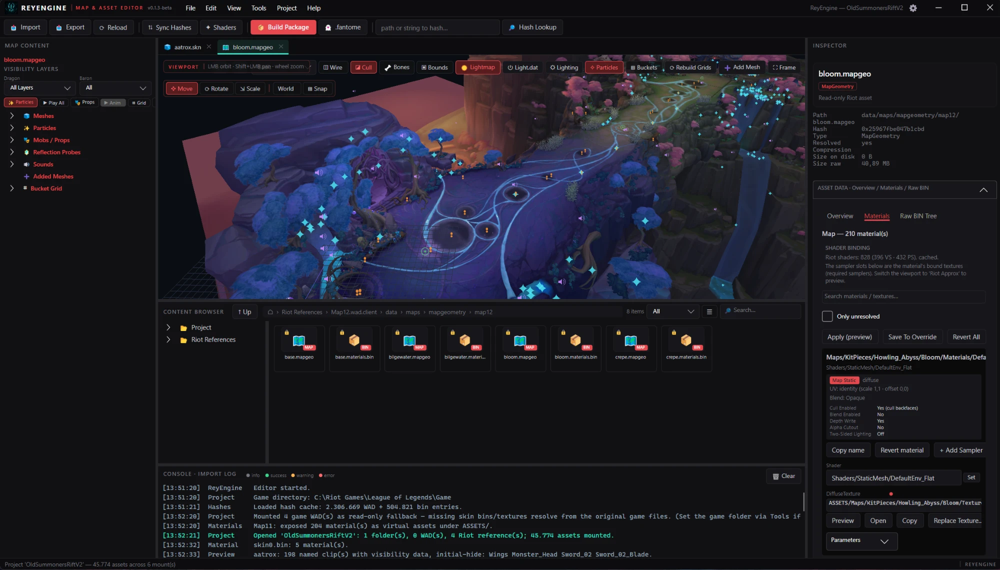

<table>
  <tr>
    <td width="50%">
      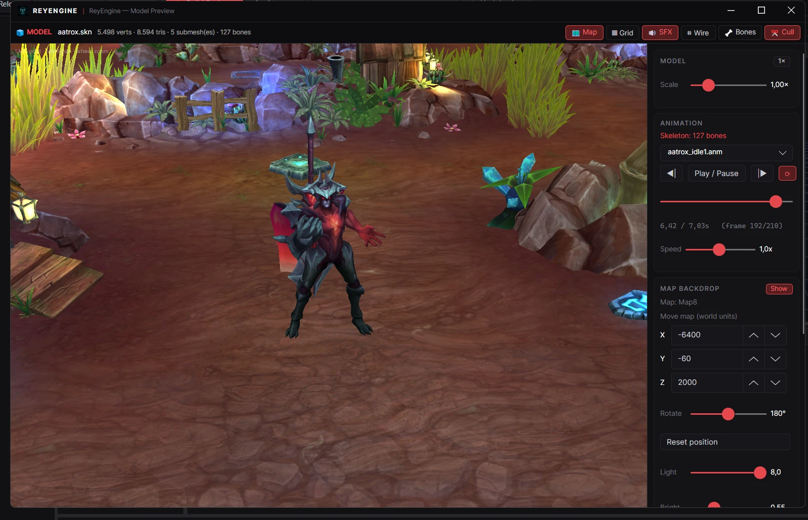<br/>
      <sub><b>Model Preview</b> — champions on the classic Dominion map, with in-game-accurate animations, VFX &amp; SFX</sub>
    </td>
    <td width="50%">
      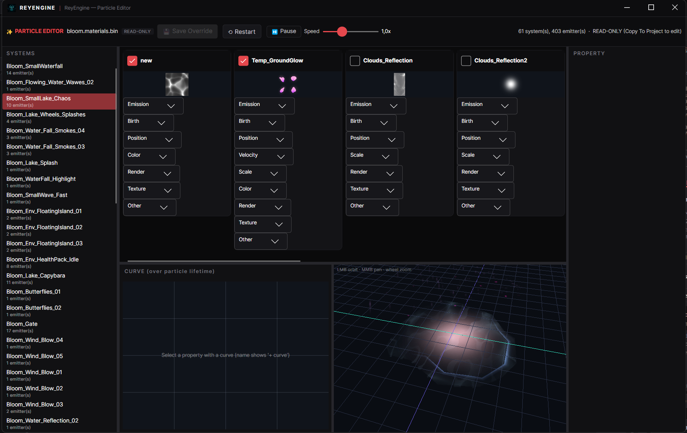<br/>
      <sub><b>Particle Editor</b> — live-edit VFX systems with in-viewport playback</sub>
    </td>
  </tr>
  <tr>
    <td width="50%">
      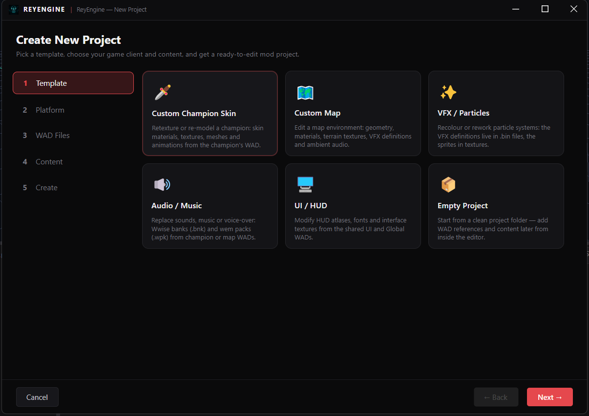<br/>
      <sub><b>New Project wizard</b> — templates for skins, maps, VFX, audio and UI mods</sub>
    </td>
    <td width="50%">
      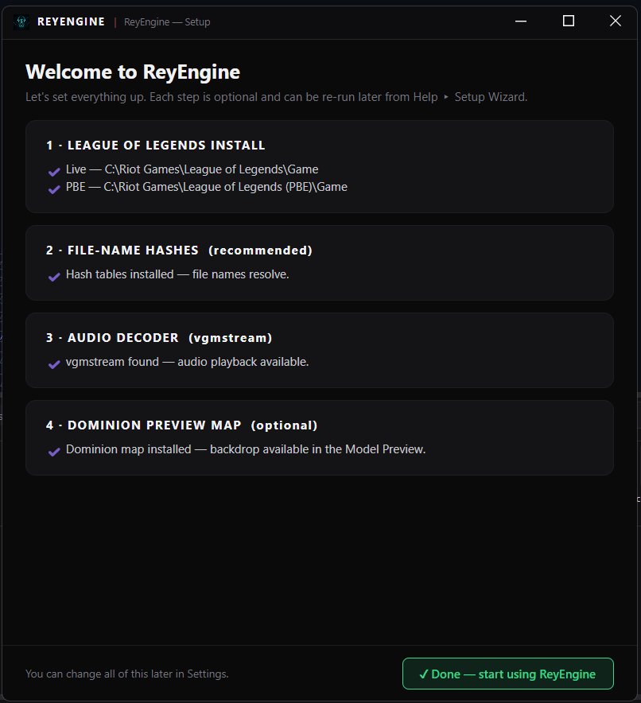<br/>
      <sub><b>Setup wizard</b> — hashes, audio decoder and preview map in a few clicks</sub>
    </td>
  </tr>
</table>

## Features

<details>
<summary><b>Projects</b> — templates, .fantome import, safe packaging, automatic patch updates</summary>

- Unreal-style **New Project wizard**: pick a template (Champion Skin / Map / VFX / Audio / UI / Empty), choose your **LIVE or PBE** client (auto-detected), tick the WADs you want, pick which content categories to extract — get a ready-to-edit mod project (cslol-style folders + read-only Riot references).
- **Import .fantome**: convert any existing mod package into an editable project — mod name/author/thumbnail carry over, WADs unpack with resolved file names, and matching Riot WADs attach as references. Full round trip: *import → edit → Build Package → new .fantome*.
- Non-destructive by design: Riot files are never modified; edits become **project overrides** that build into a distributable `.wad.client` / `.fantome` package.
- **Send to LTK Manager** creates or updates the mod in LTK Manager in place. **Content layers** let a mod ship optional parts that players can switch off on their own.
- **Automatic Riot patch rebasing**: when the installed client advances, project `.bin` edits are three-way merged onto Riot's new originals, backed up, validated, and rebuilt as WAD + `.fantome`. Conflicts and retained full-replacement assets are reported for review; the behavior can be disabled per project.
- **First-run setup wizard** gets a fresh install working in a few clicks: hashes, audio decoder, optional preview map (re-run any time via *Help ▸ Setup Wizard*).
</details>

<details>
<summary><b>Maps</b> — Riot's own shaders, gizmos, new meshes and props, recolours, map skins, lighting</summary>

- Load `.mapgeo` maps with baked lightmaps, terrain-blend & flowmap-water shaders, GrassTint (VertexDeform), display-correct decals — or switch the viewport to **Direct3D 11** and draw every material with Riot's own compiled shaders.
- Select / move / rotate / scale **map meshes, particles, sounds and props** with viewport gizmos — full undo, snapping, world/local space. Edits are saved by surgical byte patching (originals stay byte-exact).
- **Add new meshes to a map**: import `.obj` / `.scb` / `.sco` / `.fbx` / `.glb` / `.skn`, place with the gizmo, assign a map material, save — appended straight into the mapgeo.
- **Place props that appear in game**: props are written the way Riot places its own decorations, so the game client spawns them; they can wait for the game clock before appearing.
- **Map Skin Switcher** safely forces a normal map (for example Map11 / Base_SRX) through another shipped environment (for example Milkshake), keeping the gameplay IDs the server needs and routing the skin's music and ambience. Paid TFT arenas / Map22 are intentionally excluded.
- **Recolor Textures** adjusts map surfaces, placed mobs / animated props and baked lightmaps together, with presets and `.cube` colour grades always re-derived from Riot's originals.
- **Lighting**: sun, sky and lightmap brightness, classic Riot `Light.dat` point lights, and lightmap / lightgrid baking.
- **Bucket grids**: view the real 3D culling bake, and regenerate grids after editing geometry.
- **Classic NVR maps**: the old-format Dominion / Crystal Scar loads with faithful four-blend ground shading — used as the Model Preview backdrop (separate ~66 MB [map asset pack](https://github.com/TheKillerey/ReyEngine/releases/tag/maps)).
- **Cinematic Capture** flies a keyframed camera through the map and exports a smooth PNG sequence — the clips above were made with it.
</details>

<details>
<summary><b>Characters</b> — champions on Riot's shaders, with their animations, VFX and sounds</summary>

- Champion viewer with animations, per-submesh visibility (game-accurate: skin-bin initial hide + per-clip show/hide events, with manual override), and model scale.
- **Plays like in-game**: animation clips trigger their VFX bone-attached and their SFX through the champion's real Wwise banks — frame-accurate, retriggered on loop.
- Preview champions **standing on the Dominion map**, lit by its original point lights — movable, rotatable, tunable.
</details>

<details>
<summary><b>Assets</b> — Content Browser, bin editing, particles, audio, HUD</summary>

- Content Browser with Explorer-grade file ops: rename, delete, move, drag & drop (in and out), open-with-text-editor, thumbnails, type filters, search.
- Texture/mesh/skeleton/animation preview, `.bin` structure editor, ritobin text editing, material editor with Riot shader awareness, hash resolving (CommunityDragon).
- **Particle editor**: live-edit VFX systems (colors, curves, textures) with in-viewport playback.
- **Audio**: browse Wwise banks, play events (vgmstream), replace `.wem` sounds, positional map ambience.
- **HUD editor**: view and inspect the in-game HUD layout.
- **Mod Health**: validate bins the way the game will load them, find crash-causing cubemap probes, report dead files and clean them up safely.
</details>

<details>
<summary><b>Polish</b></summary>

- Dark themes switchable live, an optional background picture, custom chrome on every window, auto-update against GitHub releases, and **Help ▸ What's New** after every update.
</details>

## Build from source

```
dotnet build src/ReyEngine.App/ReyEngine.App.csproj -c Release
```

Requires the .NET 10 SDK, Windows.

## Built with

[LeagueToolkit](https://github.com/LeagueToolkit/LeagueToolkit) · [Avalonia UI](https://avaloniaui.net) · [Silk.NET](https://github.com/dotnet/Silk.NET) · [CommunityToolkit](https://github.com/CommunityToolkit/dotnet) · [NAudio](https://github.com/naudio/NAudio) · BCnEncoder.NET · SharpGLTF · Inter

Thanks to [CommunityDragon](https://communitydragon.org) (hashes), [vgmstream](https://github.com/vgmstream/vgmstream) (Wwise decoding), the [MapgeoAddon](https://github.com/TheKillerey/MapgeoAddon) research, and the League modding community.

## License

ReyEngine is released under the [MIT License](LICENSE). © 2026 TheKillerey.

## Code signing policy

Free code signing for Windows binaries is provided by [SignPath.io](https://signpath.io), with a certificate issued by the [SignPath Foundation](https://signpath.org).

Every signed release is built automatically by GitHub Actions from this public repository; SignPath verifies that the signed binary originates from the tagged source before signing it. No binary is signed from a local machine.

- **Committers & reviewers:** [TheKillerey](https://github.com/TheKillerey)
- **Approvers:** [TheKillerey](https://github.com/TheKillerey)

## Privacy policy

ReyEngine does not transfer any personal data to networked systems. It makes a few outbound network requests, all initiated by the user or clearly disclosed:

- **Update check** — on startup (and via *Help ▸ About*), it queries the public GitHub Releases API for this repository to see whether a newer version exists. Only the request itself is sent; no personal or usage data is transmitted. A new release is shown with its changelog; *Settings ▸ General ▸ Updates* chooses between installing it automatically, asking first, or only opening the download page. The MSI takes the same choice on its options page or as `msiexec /i ReyEngine-vX.Y.Z-win-x64.msi AUTOUPDATE=0`.
- **Hash sync** — when you choose to sync hash tables, it downloads public hash lists from [CommunityDragon](https://communitydragon.org).
- **Project patch update** — for projects with automatic patch rebasing enabled, opening the project checks CommunityDragon's public patch list and downloads the old Riot `.bin` originals needed for a local three-way merge. No project files are uploaded.
- **Setup downloads** — the setup wizard downloads [vgmstream](https://github.com/vgmstream/vgmstream) and the optional [map asset pack](https://github.com/TheKillerey/ReyEngine/releases/tag/maps) from GitHub when you click their buttons.

ReyEngine only reads your local League of Legends installation and writes to the project/output folders you select. Uninstall an MSI install from Windows' *Installed apps*, or delete the extracted zip folder.

## Legal

ReyEngine was created under Riot Games' ["Legal Jibber Jabber"](https://www.riotgames.com/en/legal) policy using assets owned by Riot Games. Riot Games does not endorse or sponsor this project.
